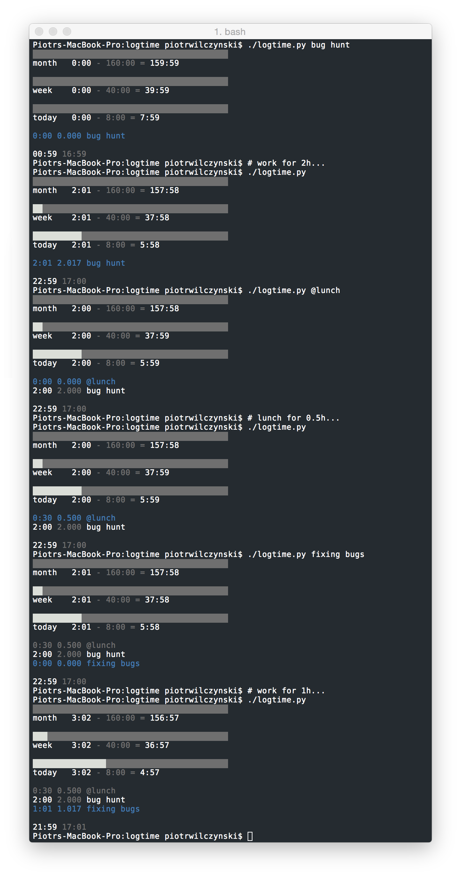
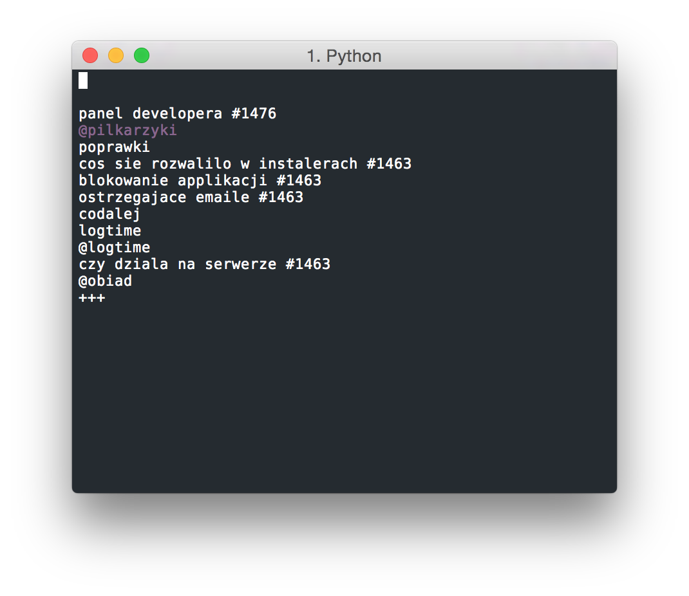

# logtime

Little and quick utility to log what are you spending time on. Run the script with description of what you are doing to start logging and run without any arguments to show statistics.



Entries that are prepended with @ are considered breaks and are not counted into goals. `Printer` that I'm using displays only todays entries and progress for current month, week and day but you can implement another one. Items from log are parsed to `Calendar` object. 


```
Usage:
    logtime.py
    logtime.py <task_description>...
    logtime.py -e
    logtime.py -f

Options:
    -h --help                     Show this screen.
    -e --end                      End current task.
    -f --file                     Open file with log.
```

Items are stored in single plain text file that has simple format:

```
YYYY-MM-DD HH:MM
<entry description>
YYYY-MM-DD HH:MM
```

First timestamp before `<entry description>` is considered as entry start time and first after as end time.

# red

`red.py` takes entries logged in logtime and sends them to yours overlord redmine.

Redmine requires two things to create time entry: issue id and activity id
- you can add `#<issue_id>` to entry description otherwise you'll be asked for one
- you can add `@<activity_mnemonic>` to entry description or default activity will be used

Activities can be configured in config.py, activity mnemonic is created from first letters of activity title.

# lp

`Lp` uses [selector](https://github.com/bevesce/selector) to display previous entries and lets you search them and choose one to begin working on it once again.

