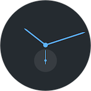

# logtime

*Logtime* allows you to keep track of time spent on different tasks in plain text and report on it using Python. It uses the following syntax:

```
# comment
2016-09-26 14:00
# ↑ start time
programming - logtime - readme  
# ↑ tag 1     ↑ tag 2   ↑ tag 3
2016-09-26 15:00  
# ↑ end time of "programming - logtime - readme" and at he same time start time of "programming - finanse"
programming - finanse
# ↑ tag 1     ↑ tag 2
2016-09-26 16:00  
# ↑ end time of "programming - finanse"
```

This file format is designed to allow to start and end tracking task by simply appending to a file. Text can be parsed into `Log`, which is basically list of `LogItem`s. `LogItem` has `start` time, `end` time and ordered list of `tags`.

```
from logtime import Log

log = Log("""2016-09-26 14:00
tv - steven universe
2016-09-26 15:00
eating - spiders
2016-09-26 15:15
programming - logtime - readme
2016-09-26 17:45
programming - finanse""")
```

`Log` can be filtered, minute by minute:

```
>>> print(log.filter('start > 2016-09-26 15:30'))
2016-09-26 15:31
programming - logtime - readme
2016-09-26 17:45
2016-09-26 17:45
programming - finanse
2016-09-26 18:15
```

It can be grouped:

```
>>> print(log.group('tags[0]'))
eating = 0:15:00
programming = 3:00:00
tv = 1:00:00
```

As an argument to `.filter` and `.group` you can either pass a function that will receive `LogItem`s or a string. When you pass the string it will be evaluated using `eval` with `LogItem`s attributes as global variables. 

`Log` can also be summed:

```
>>> print(log.sum())
4:15:00
```

## Report

`report` module includes simple command line reporting tools:

```
from logtime import report

report.print_progress(log, goal=timedelta(hours=8))
```


```
report.print_timeline(
    log, start=datetime(2016, 9, 26, 14), end=datetime(2016, 9, 26, 18)
)
```


```
report.print_breakdown(log)
```


## Installation

All manual for now.

## License

Copyright 2016 Piotr Wilczyński. Licensed under the MIT License.
